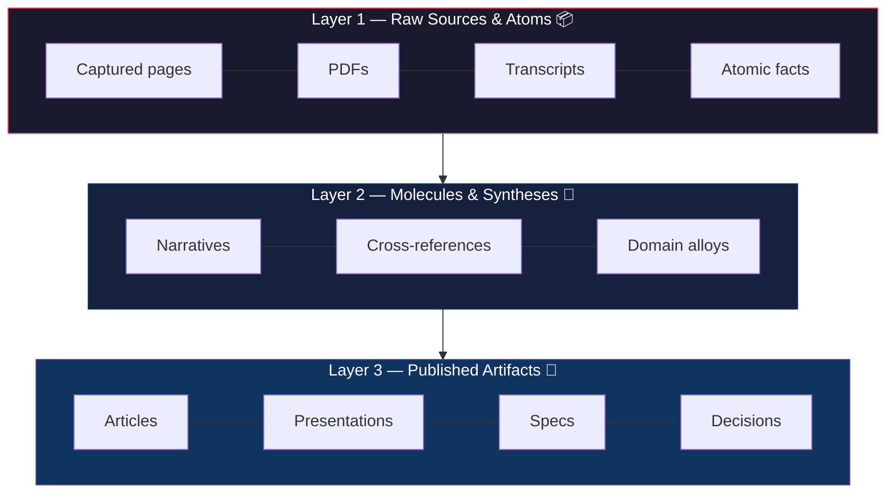

# Artifact Pyramids

**Progressive disclosure for what AI agents produce.**

The Artifact Pyramid is a structured methodology for organizing AI agent research outputs across three fidelity layers. Just as progressive disclosure governs how we feed agents context, the Artifact Pyramid governs what they produce — enabling downstream agents and humans to consume at the depth they need.



## Why?

Current AI agent workflows use progressive disclosure on the **input side** (metadata → instructions → resources) but produce flat, monolithic outputs on the **output side**. The Artifact Pyramid fixes this asymmetry, making agent outputs:

- **Independently consumable** at every layer of fidelity
- **Bidirectionally traceable** from published claim back to source
- **Pipeline-friendly** for multi-agent research workflows
- **Quality-gated** at each transformation step

## Quick Start

```bash
# Check pyramid health of a research project
scripts/pyramid-status.sh ./my-project

# Extract candidate atoms from a source file
scripts/extract-atoms.py source.txt --source-id paper-001 --domain scaling-laws

# Scaffold a new research project
cp assets/pyramid-template.md ./my-project/00-index.md
```

## Repository Structure

```
artifact-pyramids/
├── SKILL.md                    # Agent Skills-compliant skill (loadable by AI agents)
├── README.md                   # This file
├── LICENSE                     # MIT
├── scripts/
│   ├── pyramid-status.sh       # Audit a project directory for pyramid coverage
│   └── extract-atoms.py        # Extract atomic claims from source text
├── references/
│   ├── artifact-pyramid-framework.md   # Full conceptual foundation
│   ├── pipeline-stages.md              # Detailed transformation rules per layer
│   ├── quality-gates.md                # Verification criteria at each layer
│   └── synthetic-example.md            # Complete worked example (synthetic data)
└── assets/
    ├── pyramid-template.md             # Project scaffold template
    └── artifact-inventory.md           # Cross-layer tracking template
```

## For AI Agents

This repo ships as an [Agent Skills](https://agentskills.io)-compliant skill. To load it in Hermes Agent:

```bash
git clone https://github.com/groktopus/artifact-pyramids ~/.hermes/skills/artifact-pyramids
```

Then any session with the skill loaded can call `skill_view(name='artifact-pyramids')` to activate it.

## The Three Layers

| Layer | Contents | Quality Gate |
|-------|----------|-------------|
| **1: Raw Sources & Atoms** | Captured sources (PDFs, pages, transcripts) + extracted atomic claims | Each atom is one claim, context-independent, source-attributed |
| **2: Molecules & Syntheses** | Connected narratives, cross-referenced knowledge, cross-domain alloys | Molecule makes a claim no atom alone makes; all traceable |
| **3: Published Artifacts** | Articles, presentations, specs, decisions | Every claim traces to a molecule (which traces to atoms/sources) |

## License

MIT
